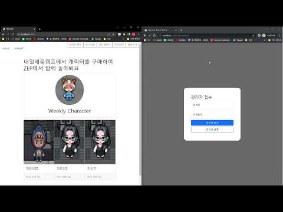
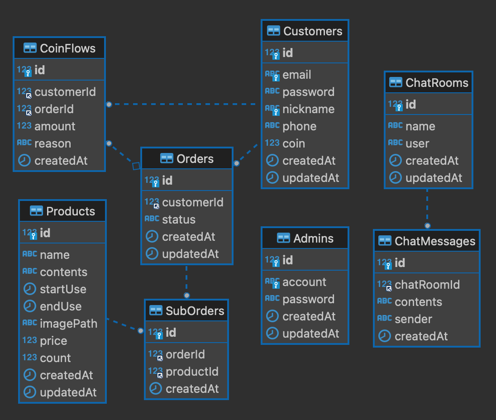

# 데브시티(DevCity)

<br>

`데브시티(DevCity)`, 내일배움캠프 캐릭터의 재능을 거래하는 이커머스 웹 페이지

<br>
<br>

## 📌 목차 

- [시연 영상](#-시연-영상)
- [기술스택](#%EF%B8%8F-기술스택)
- [프로젝트 구조](#-프로젝트-구조)
- [설계](#-설계)
- [팀원 소개](#-팀원-소개)

<br>
<br>

## 🎥 시연 영상

> 아래 이미지를 클릭하면 시연 영상을 시청할 수 있습니다.

[](https://www.youtube.com/watch?v=LmmGEA8DwzY)

<br>
<br>

## ⚙️ 기술스택

<div>
  <!-- Express -->
  
  <!-- Node.js -->
  
  <!-- Sequelize -->
  
</div>

<div>
  <!-- MySQL -->
  
  <!-- Redis -->
  
  <!-- GitHub -->
  
</div>

<br>
<br>

## 🗂 프로젝트 구조

<details>
  <summary><b>Express + ejs</b></summary>

```html
📦src
 ┣ 📂controllers
 ┣ 📂errors                     # 커스텀 에러 관련
 ┣ 📂middlewares                # 미들웨어 관련
 ┣ 📂public
 ┃ ┣ 📂css
 ┃ ┣ 📂images
 ┃ ┣ 📂js
 ┃ ┗ 📂uploads                  # 이미지 업로드 폴더
 ┣ 📂repositories
 ┣ 📂routes                     # 라우터 설정 
 ┣ 📂sequelize                  # model 등 sequelize 관련
 ┣ 📂services
 ┣ 📂utils
 ┃ ┣ 📜PaginationUtil.js        # 페이지네이션 값 세팅 유틸
 ┃ ┣ 📜RedisUtil.js             # Redis 사용 유틸
 ┃ ┣ 📜TokenUtil.js             # 토큰 관리 유틸
 ┃ ┣ 📜UploadUtil.js            # multer를 통한 이미지 업로드 유틸
 ┃ ┗ 📜bcryptUtil.js            # 암호화 유틸
 ┣ 📂views
 ┃ ┣ 📂admins                   # 관리자 페이지 관련
 ┃ ┣ 📂components               # heaer, pagination 등의 공통 컴포넌트
 ┃ ┣ 📂customers                # 고객 페이지 관련
 ┃ ┣ 📂orders                   # 주문 페이지 관련
 ┃ ┣ 📂products                 # 상품 페이지 관련
 ┃ ┗ 📜index.ejs
 ┗ 📜app.js
```
</details>

<br>
<br>

## 🛠 설계

<details>
  <summary><b>ERD</b></summary>
  <div markdown="1">
    <ul>
      <div></div>
    </ul>
  </div>
</details>

<details>
  <summary><b>API</b></summary>
  <div markdown="1">
    <ul><li>이미지로 올리기엔 너무 긴 관계로 링크로 대체하였습니다.</li></ul>
    <ul>
      <a href="https://skillful-cyclamen-d40.notion.site/eb326f27e699482392e361267762d207?v=4aa4a93290454165ada97d3878368ccf" target="_blank" style="font-size: 25px;">[Notion 링크] API 보러가기</a>
    </ul>
  </div>
</details>

[▶️ 기획안](https://www.notion.so/e-85b15a972ef54211abda5556e8d2d6c9)   
[▶️ 발표 PPT](https://docs.google.com/presentation/d/1hfnP6gP54iz7mkT-fmDBt1hhzk_ysTpyTsjO7eWsRU0/edit#slide=id.g1f08e8c50c2_1_49)   
[▶️ 회고록](https://skillful-cyclamen-d40.notion.site/e-4bdff68c6e6046e9a170da5f13a59f8b)

<br>
<br>

## 👨‍👨‍👧‍👦 팀원 소개

|  |  |  |
| :-: | :-: | :-: |
| 이보형 | 조성훈 | 최호인 |
| [GitHub](https://github.com/boleesystem), [블로그](https://boleesystem.tistory.com) | [GitHub](https://github.com/cchoseonghun), [블로그](https://4sii.tistory.com) | [GitHub](https://github.com/Admine1147) |
| boleesystem@gmail.com | cchoseonghun@gmail.com | Admine1147@gmail.com |